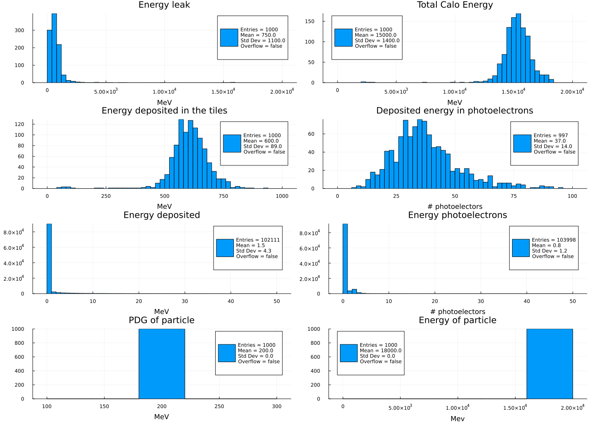
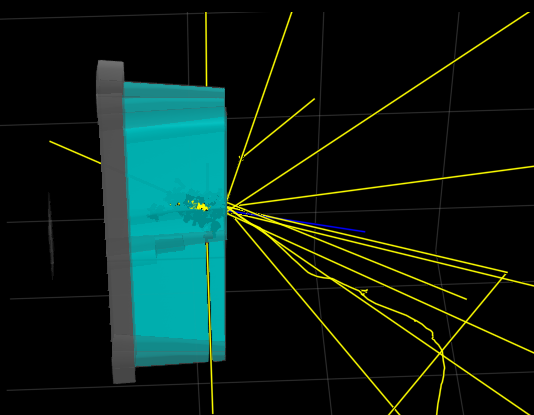

# ATLTileCalTB.jl

A Geant4 simulation of the ATLAS Tile Calorimeter beam tests using [Geant4.jl](https://github.com/JuliaHEP/Geant4.jl) based on the C++ version developed by Lorenzo Pezzotti.

Refer to the original [project](https://github.com/lopezzot/ATLTileCalTB) for the details.

## HowTo run this Julia version
Assuming you have julia (version > 1.9) installed in your system. Otherwise get it from [Julia downloads](https://julialang.org/downloads/)
- Download this project
  ```sh
  git clone https://github.com/peremato/ATLTileCalTB.jl.git
  ```
- Install all needed packages and their dependencies
  ```sh
  julia --project=ATLTileCalTB.jl -e 'import Pkg; Pkg.instantiate()'
  ```
- Run the julia program
  ```sh
  cd ATLTileCalTB.jl
  julia --project=. src/ATLTileCalTB.jl
  ```
  You should get the file `pi+18GeV1000.png` with the generated distributions this one.
  

## Changing the input particle and energy
You can add the following lines, as an example, to change the particle type and energy and execute a new run for `mu+` at 10 GeV
```julia

SetParticleEnergy(particlegun, 10GeV)
SetParticleByName(particlegun, "mu+")
beamOn(app, 1000)
do_plot(app.simdata[1], out="mu+10GeV1000.png")

```
## Visualizing the Detector and Event
The script `src/ATLTileCalTBVis.jl` provides a minimalistic program for visualizing the geometry of the detector and display of one event.


## Performance
Run benchmark to comparing execution time between the Julia and the C++ version. 
- Platform: MacMini equipped with M1 chip (4 threads)
- Input: 2000 pi+ at 18 GeV

|          |   C++    | Julia   |
|----------| -------- | ------- |
| time (s) | 143      | 158     |

- The somehow lower performance is due to the delayed GC of allocated memory during the execution.

## Current problems/issues
### Memory allocations
- Currently each callback (stepping action and/or process hit) takes about 113 bytes in 2.5 allocations. Need to understand the origin of these.
- Garbage collection is disabled while the G4 working threads are working, so even with small allocations they are accumulated and the program may fail after several thousands of events.
### Event display
- Hits and steps inside the calorimeter are not drawn with the full color. The color of the hit (yellow) is added to the color of the calorimeter.